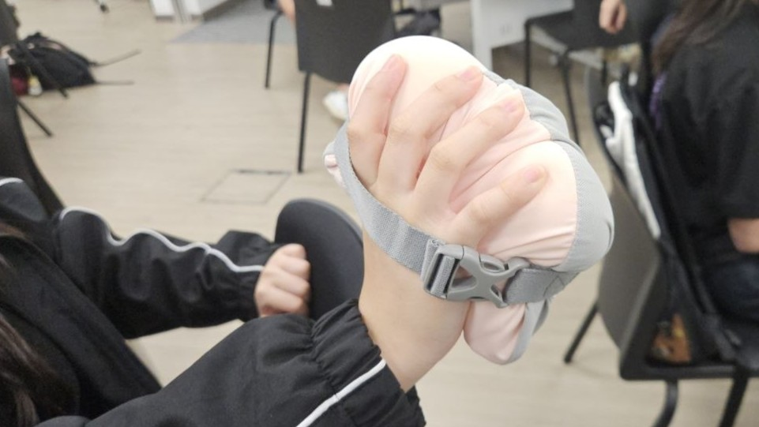

# Pebble



Pebble is a soft weighted smart movement system designed for older adults in Active Ageing Centres and community exercise programmes. Seniors hold two soft weighted pods and follow an instructor through simple guided movements. The system compares their motion to the instructor's in real time and translates participation into shared visual feedback (flowers growing on a projected screen) making strength-building movement feel social, familiar, and non-intimidating.

## How It Works

During a session, the instructor and each participant hold sensor-equipped pods. The instructor leads simple movements (raise arms, wave side to side, gentle lifts). Each pod measures acceleration 100 times per second, removes the effect of gravity, and wirelessly sends a movement summary to a laptop every 250 ms. The laptop compares each participant's movement to the instructor's, checking whether they moved in the same direction with similar intensity, and converts the match quality into flower growth on a shared display. Better matching grows flowers faster. Gentle vibrations in the pods mark milestones and time warnings to return feedback on participant's efforts and progress.

```
Pod (IMU sensor, 100 Hz) → BLE wireless → Laptop (comparison engine)
→ Web dashboard (flower garden) → Vibration feedback back to pods
```

## Hardware

Each Pebble pod contains:

| Component | Part | Role |
|---|---|---|
| Microcontroller | [Seeed XIAO ESP32S3](https://www.seeedstudio.com/XIAO-ESP32S3-p-5627.html) | Main controller; collects sensor data, processes it, and transmits wirelessly via BLE to the laptop hub |
| Motion sensor | MPU6050 6-axis IMU (I2C) | 3-axis accelerometer + 3-axis gyroscope; tracks acceleration, orientation, and rotational movement at 100 Hz during exercise |
| Vibration motor | Small coin motor via PWM | Provides haptic milestone feedback during activities |
| Power | Battery | Untethered operation during sessions |
| Housing | Soft weighted casing (~0.5–1 kg) | Provides light physical resistance for strength-supporting movement; comfortable to hold |

Together, these components allow Pebble to function as a lightweight, sensor-enabled resistance training tool for guided group exercise. The MPU6050 captures movement data that the ESP32S3 processes and sends to the laptop, where it is compared against the instructor's reference movement.

**Pod wiring:**

| Signal | XIAO Pin | GPIO |
|---|---|---|
| SDA (data) | D4 | GPIO5 |
| SCL (clock) | D5 | GPIO6 |
| Interrupt | D3 | GPIO4 |
| Motor | D0 | GPIO1 |

An optional LED strip controller (second XIAO ESP32S3 + WS2812B strip) can display a tug-of-war colour bar showing the team score ratio in competitive mode.

## Key Features

- **Instructor-following scoring** — Each participant's movement is compared to the instructor's on a vertical (up/down) and horizontal (intensity) basis. Matching movements score 90–100%; opposite vertical movements are penalised below 50%.
- **Works at any holding angle** — The system uses each pod's gravity direction to determine "up" and "down" independently, so scoring is accurate regardless of how a senior holds or grips the pod.
- **Two session modes** — Single group (everyone contributes to one shared garden) and competitive (two teams race to grow more flowers before time runs out).
- **Haptic encouragement** — Eight vibration patterns provide feedback without requiring participants to look at a screen: team assignment, progress milestones, last-10-second warning, and celebration.
- **Shared visual display** — A projected flower garden grows in real time as participants move. Bilingual support (English/Chinese). Designed to be watched by the whole group, not individual screens.
- **Adjustable without technical knowledge** — Session duration, scoring sensitivity, growth speed, and display options are all in one config file. No firmware changes needed to tune the experience for different groups.

## Project Structure

```
pebble/
├── firmware/           # Pod firmware (ESP32S3, PlatformIO/Arduino)
│   └── src/
│       ├── main.cpp          # Boot sequence, sensor init, main loop
│       ├── accel/            # Motion sensor driver (MPU6050)
│       ├── window/           # 100 Hz sampling task, data buffering
│       ├── ble/              # Wireless server, sends movement data
│       ├── vibration/        # Motor pattern player (8 patterns)
│       └── config/           # Pin assignments, hardware settings
├── ble/                # Shared Python wireless library
│   ├── client.py             # Per-pod connection with auto-reconnect
│   ├── scanner.py            # Discovers nearby pods
│   ├── imu.py                # Movement data parser
│   └── constants.py          # Wireless identifiers, pattern IDs
├── FlowerGame/         # Python game backend
│   ├── main.py               # Entry point (starts wireless + server)
│   ├── config/config.py      # All tunable session parameters
│   ├── engine/
│   │   ├── controller.py     # Single-group session controller
│   │   ├── competitive.py    # Two-team session controller
│   │   ├── similarity.py     # Movement comparison algorithm
│   │   └── motion.py         # Shake detection for setup phases
│   └── ws/server.py          # Server that sends game state to display
├── GameDashboard/      # Web display (projected for the group)
│   ├── index.html            # Game interface
│   └── static/
│       ├── game.js           # Flower rendering, score display, controls
│       └── style.css         # Garden visual styling and animations
├── LEDLight/           # Optional LED strip controller firmware
│   └── src/                  # Colour bar showing team score ratio
└── HOW_PEBBLE_WORKS.txt      # Plain-English system walkthrough
```

## Prerequisites

| Dependency | Version | Purpose |
|---|---|---|
| Python | 3.10+ | Runs the game backend on the laptop |
| PlatformIO | Latest | Builds and uploads pod firmware |
| bleak | >= 0.21 | BLE wireless communication |
| websockets | >= 12.0 | Connects backend to the display |
| Browser | Chrome or Edge | Renders the flower garden dashboard |

Firmware dependencies (downloaded automatically by PlatformIO):
- `espressif32@6.11.0`
- `Adafruit MPU6050@^2.2.6`
- `FastLED` (LED strip controller only)

## Quick Start

### 1. Install Python dependencies

```bash
python -m venv .venv
.venv\Scripts\activate        # Windows
pip install -r requirements.txt
```

### 2. Flash the pod firmware

Open the `firmware/` folder in VS Code with the PlatformIO extension. Connect a pod via USB and click **Upload**.

If you see `"No serial data received"`: hold the **BOOT** button on the XIAO, press **RESET**, release **BOOT**, then upload again.

Each pod appears wirelessly as `Pebble_XXXXXX` once flashed.

### 3. Start the session backend

```bash
python -m FlowerGame
```

The backend starts on `ws://localhost:8765` and discovers nearby pods automatically.

To test without physical pods:

```bash
python -m FlowerGame --simulate --sim-pods 3
```

### 4. Open the display

Open `GameDashboard/index.html` in Chrome on the same laptop. It connects to the backend automatically. Project this screen for the group to see.

### 5. Run a session

1. Choose session duration and mode (Single Group or Competitive).
2. Press **Start Session**.
3. The instructor shakes their pod to register as the leader.
4. Press **Next** to confirm.
5. (Competitive only) Participants shake pods to join teams, then press **Let's Play**.
6. Follow the instructor's movements — flowers grow as participants match.

## Configuration

Session parameters are in [`FlowerGame/config/config.py`](FlowerGame/config/config.py). Facilitators can adjust these between sessions — no firmware changes needed.

| Parameter | Default | What it controls |
|---|---|---|
| `growth_per_window` | 3.0 | How fast flowers grow at 100% match |
| `similarity_accumulate_windows` | 2 | Comparison interval (2 = 500 ms, higher = more forgiving) |
| `similarity_growth_exponent` | 2.0 | How steeply match quality affects growth |
| `similarity_min_movement_accel` | 0.005 | Minimum movement (g) before scoring activates |
| `game_durations` | (30, 60, 120, 300) | Duration options shown on the setup screen |
| `show_match_percent` | "show" | Whether to display match % alongside the score |
| `button_points` | true | Allow facilitator to add bonus points via keyboard |
| `similarity_enabled` | true | Set to false to reward any movement, not just matching |

## Documentation

For a complete walkthrough of the system — from sensor readings through scoring to flower rendering — see [`HOW_PEBBLE_WORKS.txt`](HOW_PEBBLE_WORKS.txt).

## License

This project is licensed under the MIT License. See [LICENSE](LICENSE) for details.

## Copyright

&copy; 2026 SL2 - Sustainable Living Lab
[Sustainable Living Lab (SL2)](https://www.sl2square.org)
